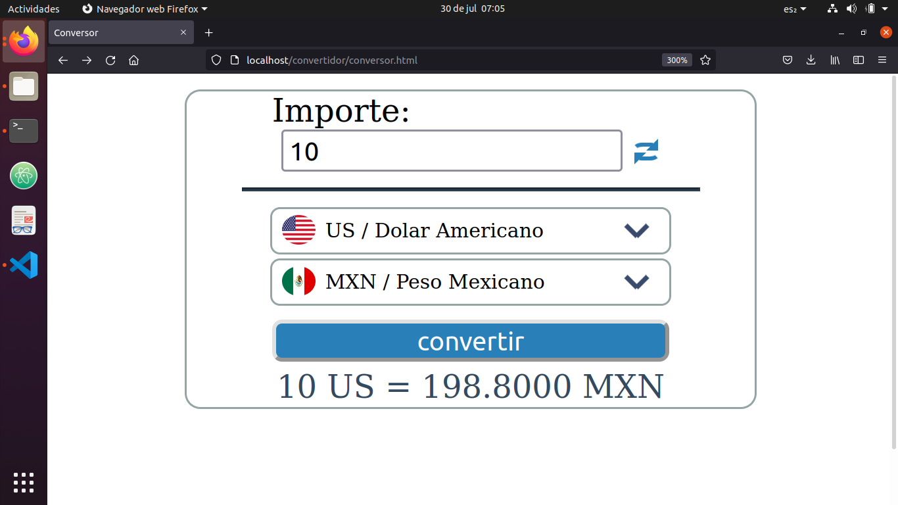

# JavaScript
Projects developped with JavaScript

## Convertidor

Convertidor is a page developped with JavaScript, HTML and CSS. It is a web page to transform currencies.

## OnMouseOver

It is a web page to use the property onMouseOver() to change background color of the body depending of the square color. 

